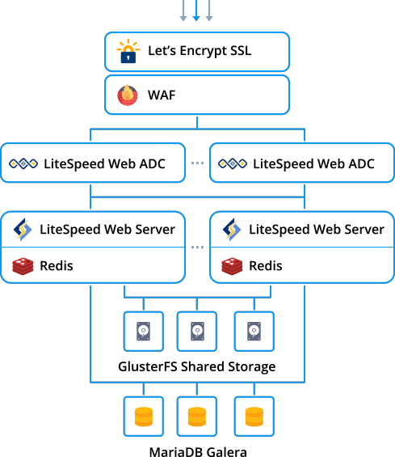
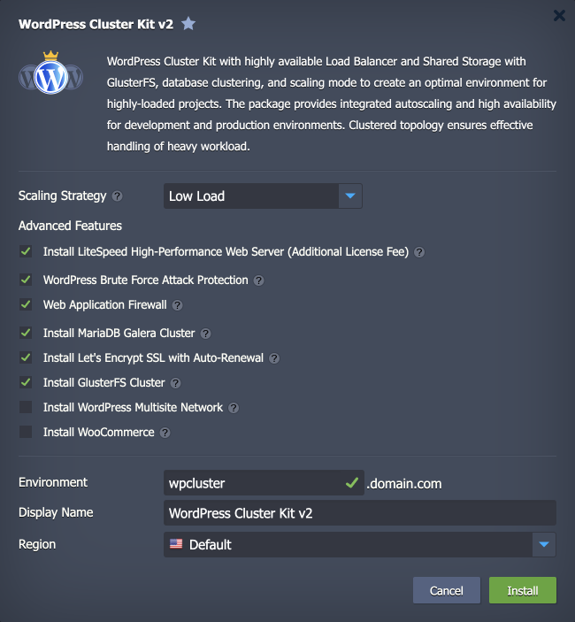
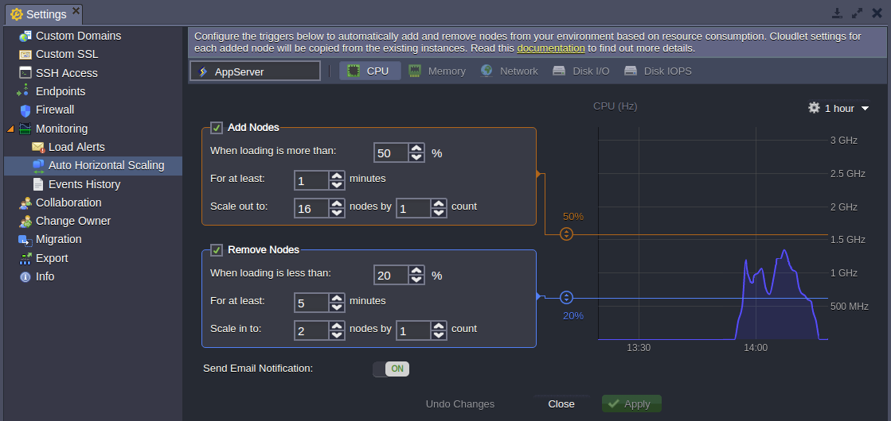
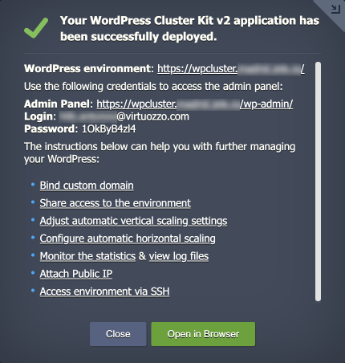

 

# Highly Available and Auto-Scalable WordPress Cluster Kit

Out-of-the-box automated WordPress Cluster solution for large businesses and mission-critical sites. WordPress cluster helps you to handle permanent high loads and huge load spikes, ensures zero downtime, improves performance, cuts maintenance costs, and, as a result, offers an excellent experience for end-users.

## WordPress Cluster Topology

This package creates a dedicated WordPress cluster environment that contains the following:

- two load balancers (either LiteSpeed ADC or NGINX) for distributing the incoming traffic within a cluster
- two application servers (either LiteSpeed or NGINX) with automatic horizontal scaling to handle load spikes
- a Redis high-performance RAM-allocated data structure store used as a high-speed caching solution
- a highly available MariaDB cluster (either Galera or Primary-Primary replication) to store and operate user data
- a dedicated Shared Storage (either a single node or a fault-tolerant cluster based on GlusterFS) for sharing common data
 

## Deployment to Cloud

To get your WordPress Cluster solution, click the "**Deploy to Cloud**" button below, specify your email address within the widget, choose one of the [Virtuozzo Public Cloud Providers](https://www.virtuozzo.com/application-platform-partners/), and confirm by clicking **Install**.

> If you already have a Virtuozzo Application Platform (VAP) account, you can deploy this solution from the [Marketplace](https://www.virtuozzo.com/application-platform-docs/marketplace/) or [import](https://www.virtuozzo.com/application-platform-docs/environment-import/) a manifest file from this repository.

## Installation Process

In the opened installation window at the VAP dashboard, customize your WordPress cluster by selecting the necessary options:

1\. The **Scaling Strategy** parameter aims to foresee possible upcoming load growth in the cluster and scale out the application servers horizontally in order to prevent WordPress application downtime.

Based on our experience, we offer three common [scaling automation scenarios](https://www.virtuozzo.com/application-platform-docs/automatic-horizontal-scaling/) for WordPress to prevent overload (these settings can be adjusted after the installation):

- ***Low Load***
  - adds **1** application server node (up to 16) if the workload is higher than **70%**
  - removes **1** application server node (down to 2) if the workload goes below **20%**
- ***Medium Load***
  - adds **1** application server node (up to 16) if the workload is higher than **50%**
  - removes **1** application server node (down to 2) if the workload goes below **20%**
- ***High Load***
  - adds **2** application server nodes (up to 16) if the workload is higher than **30%**
  - removes **1** application server node (down to 2) if the workload goes below **10%**

2\. Activate the preferred **Advanced Features** within the same installation frame.

- **LiteSpeed High-Performance Web Server** installs cluster based on [LiteSpeed Web Server](https://www.virtuozzo.com/application-platform-docs/litespeed-web-server/) and [Web Application Delivery Controller](https://www.virtuozzo.com/application-platform-docs/litespeed-web-adc/). This option provides the highest possible speed of website content delivery to the clients via modern [HTTP/3](https://www.virtuozzo.com/application-platform-docs/http3/) protocol. If you untick this option, the cluster will be installed using the NGINX web server and load balancer. The following two additional features are available only for LiteSpeed-based installations:
  - **[Brute Force Attack Protection](https://www.litespeedtech.com/support/wiki/doku.php/litespeed_wiki:config:wordpress-protection)** secures the WordPress admin panel by limiting failed login attempts. The default action is *Throttle*, and the number of allowed attempts is *100*.
  - **[Web Application Firewall](https://www.litespeedtech.com/support/wiki/doku.php/litespeed_wiki:waf)** (WAF) enables/disables the feature that protects your WordPress website by applying rules for filtering out attacking requests by checking for known attack signatures.
  > **Note:** Refer to the [LiteSpeed Web Server](https://www.virtuozzo.com/application-platform-docs/litespeed-web-server/) documentation for more details on these features and their configuration.
- **[MariaDB Galera Cluster](https://mariadb.com/kb/en/library/galera-cluster/)** is a multi-primary database cluster based on synchronous replication and the InnoDB engine. When using the Galera Cluster, you can perform direct read and write operations to any node. If any single instance goes down, there will be no cluster downtime and no complex failover procedures. In case you untick the checkbox, a [Primary-Primary database cluster](https://www.virtuozzo.com/application-platform-docs/auto-clustering/#mariadb) will be installed.
> **Note:** When manually restoring a database dump for the Galera cluster, it is essential to [consider the limitations](https://github.com/jelastic-jps/database-backup-addon/blob/main/docs/ManualRestoreFromDump.md).
- **[Let's Encrypt SSL with Auto-Renewal](https://www.virtuozzo.com/company/blog/free-ssl-certificates-with-lets-encrypt/)** add-on issues and uses a trusted, free certificate for a custom domain. The built-in functionality employs periodical renewal to prevent certificate expiration. The appropriate notifications are sent by email.
- **[GlusterFS Cluster](https://www.virtuozzo.com/application-platform-docs/shared-storage-container/#shared-storage-auto-cluster)** provides a fault-tolerant shared storage solution for your WordPress cluster. It ensures data consistency and integrity, as well as high availability and scalability.
- **[WordPress Multisite Network](https://wordpress.org/support/article/glossary/#multisite)** enables/disables the same-named feature. It allows the application to act as a WordPress network hub, where the network can comprise several websites. With this built-in feature and platform automation, you can create an independent network of websites and invite others to develop their sites on the same network even for commercial usage.
- **[WooCommerce](https://wordpress.org/plugins/woocommerce/)** is a free open-source WordPress plugin that adds e-commerce functionality to your WordPress website. Enable this option to automatically install this great platform for a store of any size hosted on your WordPress cluster.

3\. Specify **Environment** name, **Display Name**, choose availability **Region** (if available), and click **Install**.

Wait several minutes for the platform to set up your WordPress Cluster. Use the links and credentials from the successful installation frame or the appropriate email to manage your WordPress application (or even create a network).
