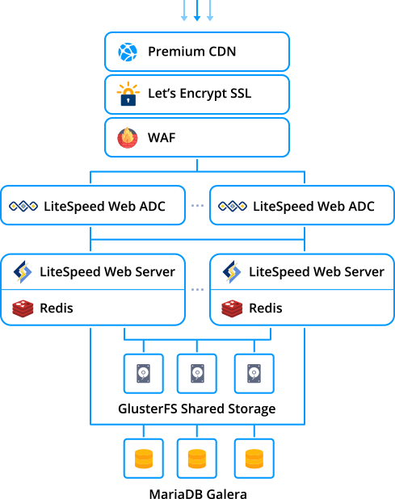
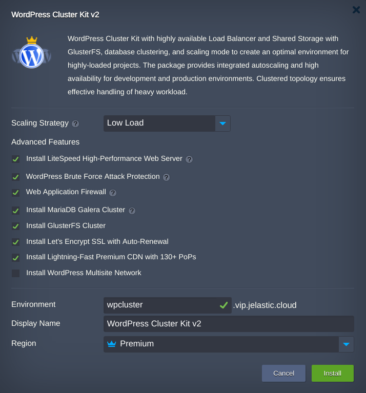

# Highly Available and Auto-Scalable WordPress Cluster v2

Out-of-the-box automated Enterprise WordPress Cluster solution v2 for large businesses and mission-critical sites

## WordPress Cluster Topology

Upon the package installation, a new environment with the following topology will be created: 

* Either highly available **[LiteSpeed ADC](https://docs.jelastic.com/litespeed-web-adc)** or **[NGINX](https://docs.jelastic.com/tcp-load-balancing)**  load balancer is used for distributing the incoming traffic within a cluster  
* **WordPress Brute Force Attack Protection** option will protect WordPress admin panel in case  **[LiteSpeed Web Server](https://docs.jelastic.com/litespeed-web-server)** is chosen  
* **Web Application Firewall** will be enabled by the default if **LiteSpeed Web Server** will be installed
* The *WordPress* application itself is handled by either **LiteSpeed Web Server** or **[NGINX PHP](https://docs.jelastic.com/nginx-php)** servers with preconfigured [automatic horizontal scaling](https://docs.jelastic.com/automatic-horizontal-scaling) to handle load spikes  
* **Redis** is high-performance RAM-allocated data structure store used as a highspeed caching solution
* Highly-available **[MariaDB Galera Cluster](https://github.com/jelastic-jps/mysql-cluster#mariadb-galera-cluster)** is used to store and operate user data   
* **[Shared Storage](https://docs.jelastic.com/shared-storage-container)** cluster, ensuring high avaiablity with GlusterFS, is mounted to all application server nodes for sharing common data  
* Traffic encryption is provided by [Let's Encrypt Add-On](https://jelastic.com/blog/free-ssl-certificates-with-lets-encrypt/)  with automatic issuing of trusted SSL certificate and Auto-Renewal.
* **[Premium CDN](https://jelastic.com/blog/enterprise-cdn-verizon-integration/)** integration in order to provide Lightning-fast static assets loading  

 

## Deployment to the Cloud

Click the **Deploy** button below, specify your email address within the widget, choose one of the [Jelastic Public Cloud providers](https://jelastic.com/install-application/?manifest=https://raw.githubusercontent.com/jelastic-jps/wordpress-cluster/master/manifest.jps&keys=app.mycloud.by;app.jelastic.eapps.com;app.hidora.com;app.rag-control.hosteur.com;app.jpc.infomaniak.com;;app.jpe.infomaniak.com;app.trendhosting.cloud;app.cloudjiffy.com;app.paas.mamazala.com;app.mircloud.host;app.paas-infra.previder.com;app.my.reclaim.cloud;app.j.scaleforce.net;app.unicloud.pl;app.unispace.io;app.trendhosting.cloud;app.cloudlets.com.au&filter=auto_cluster) and press **Install**.

[](https://jelastic.com/install-application/?manifest=https://raw.githubusercontent.com/jelastic-jps/wordpress-cluster/v2.0.0/manifest.jps&keys=app.mycloud.by;app.jelastic.eapps.com;app.hidora.com;app.rag-control.hosteur.com;app.jpc.infomaniak.com;;app.jpe.infomaniak.com;app.trendhosting.cloud;app.cloudjiffy.com;app.paas.mamazala.com;app.mircloud.host;app.paas-infra.previder.com;app.my.reclaim.cloud;app.j.scaleforce.net;app.unicloud.pl;app.unispace.io;app.trendhosting.cloud;app.cloudlets.com.au&filter=auto_cluster)

> **Note:** If you are already registered at Jelastic, you can deploy this cluster by importing the  [the package manifest raw link](https://raw.githubusercontent.com/jelastic-jps/wordpress-cluster/v2.0.0/manifest.jps) within the dashboard.

## Installation Process

In the opened confirmation window at Jelastic dashboard, if required change:  

* preconfigured horizontal __Scaling Strategy__   
 
*  what __Advanced Features__ should be installed or not  
* __Environment__ name  

* __Display Name__  

* destination __[Region](https://docs.jelastic.com/environment-regions)__ if several are available  

and click on __Install__.

 

Once the deployment is finished, you’ll see an appropriate success pop-up with access credentials to your administration WordPress panel, whilst the same information will be duplicated to your email box.

 

So now you can just click on the **Open in browser** button within the shown frame and start filling your highly available and reliable WP installation with the required content, being ready to handle as much users as your service requires.

> **Note:** Keep in mind that you can't do redeploy from previous WordPress Cluster edition to the new version. So in case you have decided to move your site to the WordPress Cluster v2 you should migrate it  following the Tutorial ["How to Migrate a WordPress Site to Jelastic PaaS](https://jelastic.com/blog/migrate-wordpress-site/) or any other one you prefer.

## WordPress Managed Hosting Business

To start offering this solution to your customers please follow to [Auto-Scalable Clusters for Managed Cloud Business](https://jelastic.com/apaas/)
