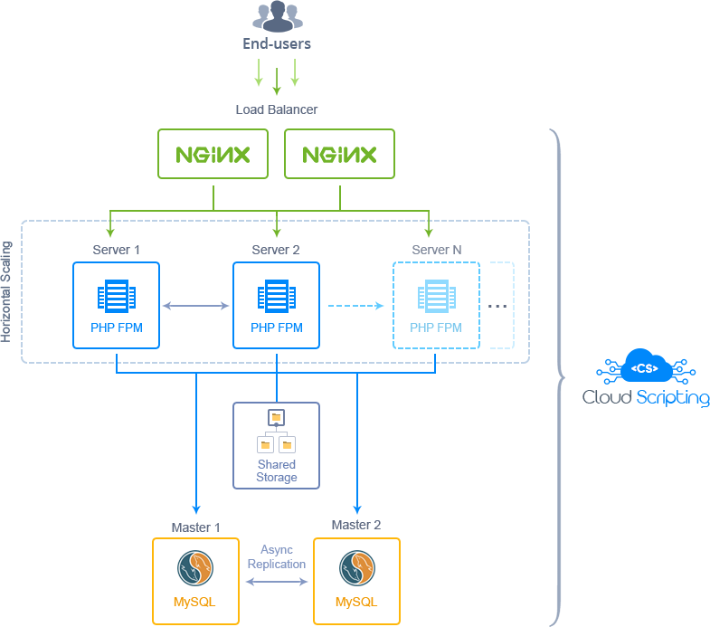

# Highly Available and Auto-scalable Wordpress Cluster

The JPS package deploy Wordpress that initially contains 2 balancers, 2 application servers, 2 MySQL databases and 1 storage container.

## Highlights
Get your highly available and scalable clustered solution for Wordpress, the extremely popular open source CMS and blogging tool. This package is designed to ensure the load tracking and distribution, as well as automatic adjusting the amount of allocated resources according to it.

## Environment Topology

### Specifics
 Layer | Server          | Number of CTs   by default | Cloudlets per CT   (reserved/dynamic) | Options
-------|-----------------| :-----------------------------:|:-----------------------------------------:|:-----:
LB     |      Nginx      |           2                    |           1/8                             |   -
AS     | Nginx (PHP-FPM) |           2                    |           1/8                             |   -
DB     |      MySQL      |           2                    |           1/8                             |   -
ST     |  Shared Storage |           1                    |           1/8                             |   -

* LB - Load balancer
* AS - Application server
* DB - Database
* ST - Shared Storage

**Wordpress Version**: Latest version 
**Nginx Version**: 1.10.1 
**Php Version**: 7.0.10 
**MySQL Database**: 5.7.14 

### Additional functionality:
* MySQL databases with configured asynchronous master-master replication;
* horizontal scaling enabled on compute nodes by CPU load. New AppServer will be added while 70% loading;

---

## Deployment

### Public Cloud

In order to get this solution instantly deployed, click the "Deploy" button, specify your email address within the widget, choose one of the [Jelastic Public Cloud providers](https://jelastic.cloud) and press Install.

 

### Private Cloud 
To deploy this package to Jelastic Private Cloud, import [this JPS manifest](../../raw/master/manifest.jps) within your dashboard ([detailed instruction](https://docs.jelastic.com/environment-export-import#import)).

### Add To Website
More information about installation widget for your website can be found in the [Jelastic JPS Application Package](https://github.com/jelastic-jps/jpswiki/wiki/Jelastic-JPS-Application-Package) reference.
