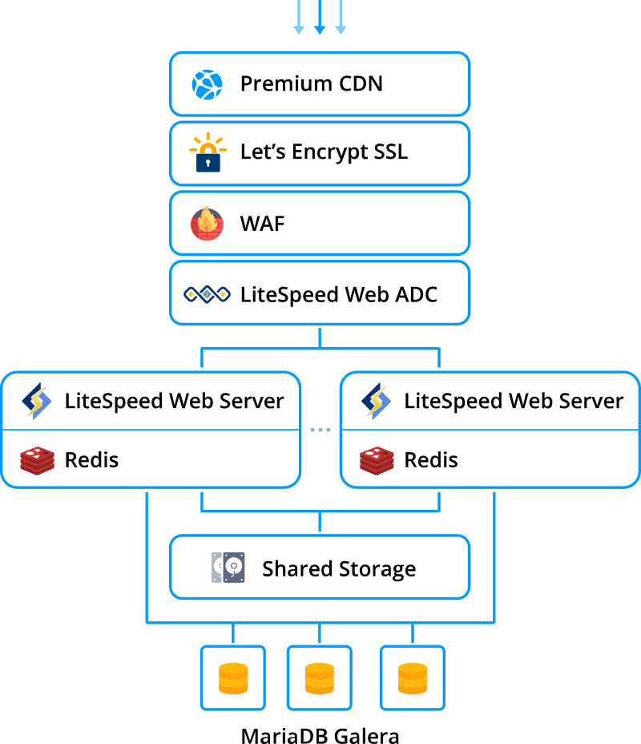
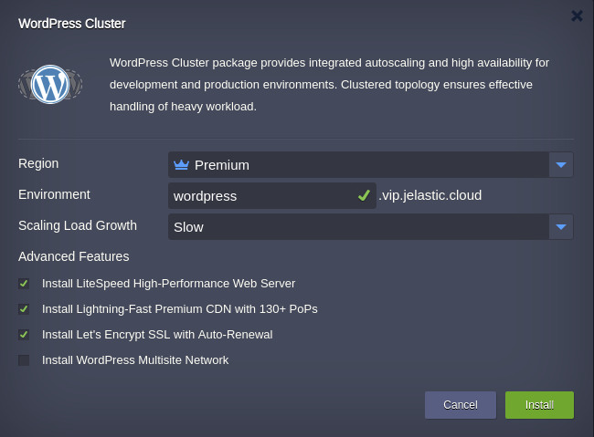
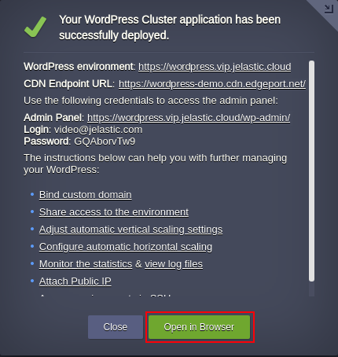

# Highly Available and Auto-Scalable WordPress Cluster

Out-of-the-box automated Enterprise WordPress Cluster solution for large businesses and mission-critical sites

## WordPress Cluster Topology

Upon the package installation, a new environment with the following topology will be created: 

* **[Premium CDN](https://jelastic.com/blog/enterprise-cdn-verizon-integration/)** integration in order to provide Lightning-fast static assets loading  
* Either **[LiteSpeed ADC](https://docs.jelastic.com/litespeed-web-adc)** or **[NGINX](https://docs.jelastic.com/tcp-load-balancing)** load balancer is used for distributing the incoming traffic within a cluster  
* **Web Application Firewall** will be enabled by the default if **[LiteSpeed Web Server](https://docs.jelastic.com/litespeed-web-server)** will be installed
* The *WordPress* application itself is handled by either **LiteSpeed Web Server** or **[NGINX PHP](https://docs.jelastic.com/nginx-php)** servers with preconfigured [automatic horizontal scaling](https://docs.jelastic.com/automatic-horizontal-scaling) to handle load spikes  
* **Redis** is high-performance RAM-allocated data structure store used as a highspeed caching solution
* **[Shared Storage](https://docs.jelastic.com/shared-storage-container)** is mounted to all application server nodes for sharing common data  
* Highly-available **[MariaDB Galera Cluster](https://github.com/jelastic-jps/mysql-cluster#mariadb-galera-cluster)** is used to store and operate user data   

 

## Deployment to the Cloud

Click the **Deploy** button below, specify your email address within the widget, choose one of the [Jelastic Public Cloud providers](https://jelastic.com/install-application/?manifest=https://raw.githubusercontent.com/jelastic-jps/wordpress-cluster/master/manifest.jps&keys=app.jelastic.elastx.net;app.milesweb.cloud;app.jelastic.eapps.com;app.jelastic.saveincloud.net&filter=auto_cluster) and press **Install**.

> **Note:** If you are already registered at Jelastic, you can deploy this cluster by importing the  [the package manifest raw link](https://raw.githubusercontent.com/jelastic-jps/wordpress-cluster/master/manifest.jps) within the dashboard.

## Installation Process

In the opened confirmation window at Jelastic dashboard, if required change:  

* preconfigured horizontal __Scaling Strategy__   
 
*  what __Advanced Features__ should be installed or not  
* __Environment__ name  

* __Display Name__  

* destination __[Region](https://docs.jelastic.com/environment-regions)__ if several are available  

and click on __Install__.

 

Once the deployment is finished, you’ll see an appropriate success pop-up with access credentials to your administration WordPress panel, whilst the same information will be duplicated to your email box.

 

So now you can just click on the **Open in browser** button within the shown frame and start filling your highly available and reliable WP installation with the required content, being ready to handle as much users as your service requires.

## WordPress Managed Hosting Business

To start offering this solution to your customers please follow to [Auto-Scalable Clusters for Managed Cloud Business](https://jelastic.com/apaas/)
