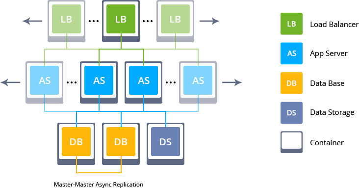
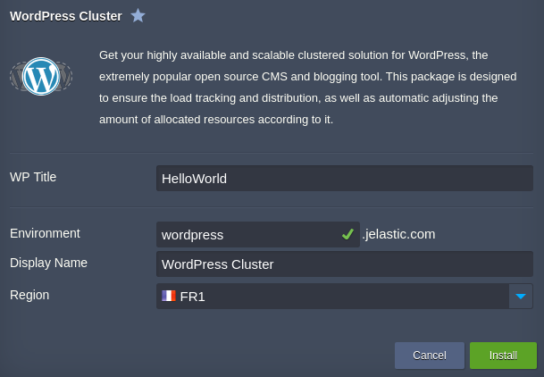
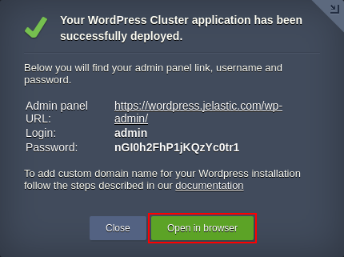

# Highly Available and Auto-Scalable WordPress Cluster

Out-of-the-box automated WordPress Cluster solution for large businesses and mission-critical sites

## WordPress Cluster Topology

Upon the package installation, a new environment with the following topology will be created: 
* **NGINX** load balancers are used for distributing the incoming traffic within a cluster
* the WordPress application itself is handled by **NGINX PHP** servers with preconfigured [automatic horizontal scaling](https://docs.jelastic.com/automatic-horizontal-scaling) to handle load spikes
* Highly-available **[MySQL DB Cluster](https://github.com/jelastic-jps/mysql-cluster)** is used to store and operate user data
* **[Data Storage](https://docs.jelastic.com/data-storage-container)** is mounted to all application server nodes for sharing common data 

## Deployment to the Cloud

Click the **Deploy** button below, specify your email address within the widget, choose one of the [Jelastic Public Cloud providers](https://jelastic.com/install-application/?manifest=https://raw.githubusercontent.com/jelastic-jps/wordpress-cluster/master/manifest.jps&keys=app.jelastic.elastx.net;app.milesweb.cloud;app.jelastic.eapps.com;app.jelastic.saveincloud.net&filter=auto_cluster) and press **Install**.

> **Note:** If you are already registered at Jelastic, you can deploy this cluster by importing the  [the package manifest raw link](https://raw.githubusercontent.com/jelastic-jps/wordpress-cluster/master/manifest.jps) within the dashboard.

## Installation Process

In the opened confirmation window at Jelastic dashboard, type the preferable **WP Title** for your blog site. Also, set an _Environment_ name and, optionally, customize its _[Display Name](https://docs.jelastic.com/environment-aliases)_. Then, select the preferable _[region](https://docs.jelastic.com/environment-regions)_ (if several are available) and click on **Install**.

Once the deployment is finished, you’ll see the appropriate success pop-up with access credentials to your administration WordPress panel, whilst the same information will be duplicated to your email box.

So now you can just click on the **Open in browser** button within the shown frame and start filling your highly available and reliable WP installation with the required content, being ready to handle as much users as your service requires.

## WordPress Managed Hosting Business

To start offering this solution to your customers please follow to [Auto-Scalable Clusters for Managed Cloud Business](https://jelastic.com/apaas/)
