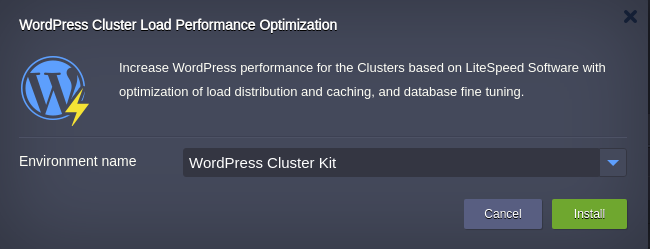
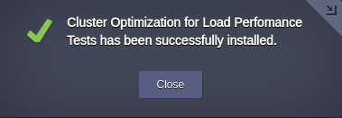

## WordPress Cluster Load Performance Optimization

This add-on is designed to increase the performance of existing WordPress Clusters based on LiteSpeed Web Server and Load Balancer stack templates. 
It is achieved via optimization those settings that make the most influence on cluster load:
  - moving Brute Force Attack Protection from backend server to Load Balancer thus web sever doesn't bear extra load by handling brute force requests   
  - caching static assets at Load Balancer layer   
  - changing balancing strategy
  - keeping the LSCache plugin up-to-date
  - disabling GZIP compression   
  - reducing the number of database disk write operations    

Settings to be optimized on:

**LiteSpeed ADC (Load Balancer)**

- enables [WordPress Brute Force Attack Protection](https://www.litespeedtech.com/support/wiki/doku.php/litespeed_wiki:config:wordpress-protection
) with parameteres:   
     * WP_PROTECT_ACTION: 3   
     * WP_PROTECT_LIMIT: 100
  
- enables static content [caching](https://www.litespeedtech.com/support/wiki/doku.php/litespeed_wiki:cache:webadc) at the load balancer thus tremendously increasing static assets output speed

- permits up 150 connections to be handled simultaneously through the *Max Connection* parameter for each of backend server(Worker Group node). Here the maximum number of concurrent connections is that can be established between the server and an external application

- sets up *Balancing strategy* as [Fastest Response](https://www.litespeedtech.com/support/wiki/doku.php/litespeed_wiki:lslb:basic_config). The Fastest Response algorithm chooses the Worker Group node that responds the fastest to a backend worker ping.

**LiteSpeed Web Server(backend server)**

- disables WordPress *Brute Force Attack Protection* since it was shouldered on the load balancer
- disables GZIP compression decreasing CPU load on backend
- updates LSCache plugin to the latest plugin version.

**DataBase**
- it turns *innodb_flush_log_at_trx_commit* = 2.  When the value is 2, the log buffer is written out to the file at each commit, but the flush to disk operation is not performed on it and it is done once per second. So it gets a very fast write speed.

## Deployment to the Cloud

Click the **Deploy** button below, specify your email address within the widget, choose one of the [Jelastic Public Cloud providers](https://jelastic.com/install-application/?manifest=https://raw.githubusercontent.com/jelastic-jps/wordpress-cluster/master/patch/loadOptimization/optimization.jps&keys=app.jelastic.elastx.net;app.milesweb.cloud;app.jelastic.eapps.com;app.jelastic.saveincloud.net&filter=auto_cluster) and press **Install**.

> **Note:** If you are already registered at Jelastic, you can deploy this cluster by importing the  [the package manifest raw link](https://raw.githubusercontent.com/jelastic-jps/wordpress-cluster/master/patch/loadOptimization/optimization.jps) within the dashboard.

## Installation Process

In the opened confirmation window at Jelastic dashboard choose the WordPress cluster to be optimized:  

 

An appropriate pop-up will appear upon successfull patch installation.

 

Congratulations! Now your WordPress cluster is ready for heavy load.
